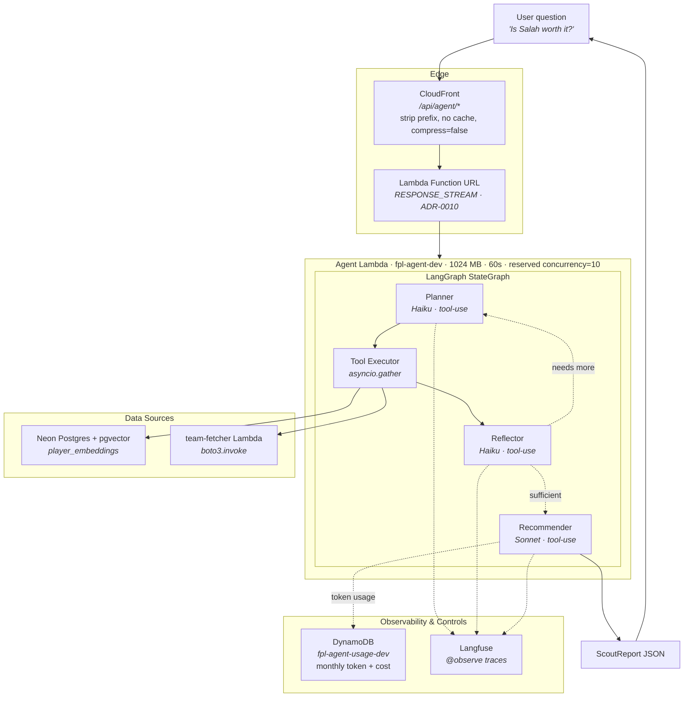
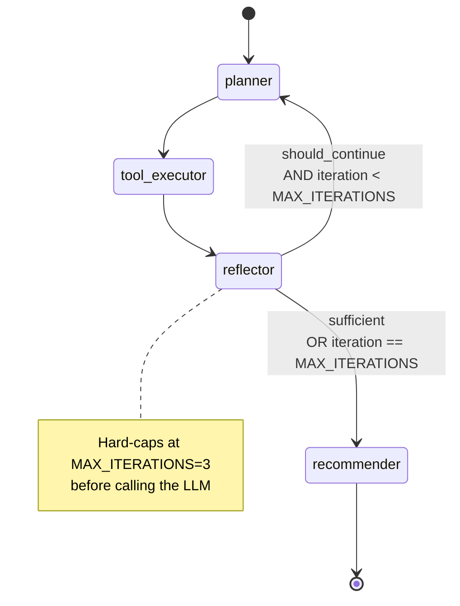

# Scout Report Agent Architecture

The Scout Report agent is a conversational LangGraph state machine that answers natural-language FPL questions ("Is Salah worth the price?", "Compare Palmer and Saka", "Best budget midfielders for the next 5 gameweeks?"). It plans which data to fetch, runs the fetches concurrently, evaluates whether it has enough data, loops if not, and finally synthesises a structured `ScoutReport`.

For the *why* behind agent-vs-chain, node count, model tiering, and public-endpoint cost controls, see [ADR-0009](../adr/0009-scout-report-agent-architecture.md). For a deep walkthrough of the LangGraph mechanics (state, reducers, tool-use structured output, factory closures) see [services/agent/docs/langgraph-walkthrough.md](../../services/agent/docs/langgraph-walkthrough.md).

## Request Flow



## Graph Topology

Four nodes, one conditional edge, three termination paths.



The reflector's conditional edge is the loop-back: it looks at the `should_continue` field set by the Haiku call (or forced to `False` when the iteration cap is hit) and picks either `planner` or `recommender`. [ADR-0009](../adr/0009-scout-report-agent-architecture.md) explains why we chose 4 nodes with a loop instead of a simpler chain.

## Node Responsibilities

| Node | Model | Purpose | Output shape |
|------|-------|---------|--------------|
| Planner | claude-haiku-4-5 | Decide which tools to call this iteration | `list[ToolCall]` via `record_plan` tool-use |
| Tool Executor | — (no LLM) | Dispatch the plan concurrently, capture errors | `dict[tool_name, result_or_error]` |
| Reflector | claude-haiku-4-5 | Decide whether the data is sufficient to answer | `ReflectionResult` via `record_reflection` tool-use |
| Recommender | claude-sonnet-4-6 | Synthesise the gathered data into a structured report | `ScoutReport` via `record_scout_report` tool-use |

Model selection follows [ADR-0004](../adr/0004-llm-cost-optimisation.md)'s principle (match model complexity to task complexity), applied per-node rather than per-enricher. Only the Recommender needs deep cross-source reasoning; the planner and reflector are structured-output decisions that Haiku handles well for 1/10th the cost.

## Tools

Five async tools, dispatched by the executor via `asyncio.gather(..., return_exceptions=True)` so one slow or broken tool does not cancel its siblings.

| Tool | Backing store | Purpose |
|------|---------------|---------|
| `query_player` | Neon | Look up a single player by name (ILIKE) |
| `search_similar_players` | Neon (pgvector) | Cosine-distance neighbours over 384-dim embeddings |
| `query_players_by_criteria` | Neon | Filter by position / price / form / team |
| `get_fixture_outlook` | Neon | Return the stored aggregate fixture-difficulty signal |
| `get_injury_signals` | Neon | Return stored injury-risk + form-trend enrichment |

Squad loading is intentionally **not** in the tool registry. The dashboard calls `GET /team` (which invokes the team-fetcher Lambda + enriches via Neon), receives a `UserSquad`, and echoes it on every chat request. The agent reads it from `state["user_squad"]` and renders it into both the planner and recommender prompts as context. Letting the agent dispatch a cross-service Lambda invoke at planning time would require it to invent a `team_id` it has no source of truth for.

All tools take a `NeonClient` through a factory closure — `make_tools(neon)` returns a dict of callables with the client captured in each scope. State never carries a live connection; see the walkthrough doc for the "why".

Per-tool timeout: `TOOL_TIMEOUT_SECONDS = 10` (Lambda's 60s ceiling minus ~15s of LLM latency leaves ~45s for up to 3 iterations of tool calls; 10s each is generous for a Neon query).

## Structured Output via Tool-Use

Every LLM call uses Anthropic's tool-use API as a structured-output mechanism — not for agentic tool invocation. Each node declares a *fake* tool whose `input_schema` is derived from a Pydantic model:

```python
_SCOUT_REPORT_TOOL = {
    "name": "record_scout_report",
    "description": "Record the final scout report answering the user's question.",
    "input_schema": ScoutReport.model_json_schema(),
}

response = await client.messages.create(
    model=RECOMMENDER_MODEL,
    tools=[_SCOUT_REPORT_TOOL],
    tool_choice={"type": "tool", "name": "record_scout_report"},  # FORCE it
    messages=[...],
)
```

Anthropic's server-side decoder constrains sampling to valid JSON matching the schema. Syntactic failures (markdown fences, missing braces, malformed strings) cannot happen — they would violate the schema at the token-sampling level. Residual semantic failures (e.g. recommender omits a required field due to an Anthropic bug) are caught at the Pydantic layer and short-circuit to `state["error"]`.

Schemas are byte-identical across calls, so **Anthropic prompt caching** stores them at 90% discount after the first call in a 5-min window. Net cost impact: within ±10% of unstructured calls, often cheaper once you account for avoided retries.

## Cost Controls

The agent endpoint is publicly accessible — anyone with the CloudFront URL can send questions. Three independent layers bound spend:

| Layer | Where | Configuration | Purpose |
|-------|-------|---------------|---------|
| Lambda reserved concurrency | Terraform (`modules/lambda`) | `reserved_concurrent_executions = 10` (currently disabled — see [#121](https://github.com/ikuzuki/fpl-platform/issues/121)) | Hardware-level backpressure; replaces API Gateway throttling after ADR-0010. Disabled until the AWS account's Lambda concurrency quota is raised from the new-account default of 10 |
| Application rate limiter | `middleware/rate_limit.py` | 5/min + 20/hour per session | Per-session fairness; in-memory per Lambda container |
| Reflector iteration cap | `graph/config.py` | `MAX_ITERATIONS = 3` | Bounds per-request LLM calls at 7 (3 planner + 3 reflector + 1 recommender). Most queries resolve in 2 iterations (5 calls) |
| DynamoDB budget kill-switch | `fpl-agent-usage-dev` | Monthly `$5` cap enforced at request entry | Hard cap on monthly spend. Returns 429 "demo has hit its monthly limit" when exceeded |

No authentication. For a portfolio project, this layered defence + a hard monthly cap is sufficient. Full security posture in [docs/architecture/security-architecture.md](security-architecture.md).

**Per-query cost estimate (ADR-0009 target range):**

| Scenario | Planner | Reflector | Recommender | Approx cost |
|----------|---------|-----------|-------------|-------------|
| Single tool, 1 iteration | 1× Haiku | 1× Haiku | 1× Sonnet | ~$0.03 |
| Typical, 2 iterations | 2× Haiku | 2× Haiku | 1× Sonnet | ~$0.05 |
| Complex, 3 iterations (cap) | 3× Haiku | 2× Haiku* | 1× Sonnet | ~$0.08 |

*Third reflector call is skipped (hard cap short-circuits before calling the LLM).

## Observability

Every node and tool is decorated with Langfuse `@observe()`. The trace hierarchy per request:

```
request (trace)
├── node.planner (span)
│   └── [Anthropic API call]
├── node.tool_executor (span)
│   ├── tool.query_player (span)
│   └── tool.get_fixture_outlook (span)
├── node.reflector (span)
│   └── [Anthropic API call]
└── node.recommender (span)
    └── [Anthropic API call]
```

Each LLM node logs `input_tokens` + `output_tokens` at INFO level for CloudWatch-based cost tracking. The DynamoDB budget writer (PR #93) consumes these logs to keep the `usage[month]` row up to date. Langfuse traces surface the full plan, gathered data, and ScoutReport at each step — non-trivial for debugging "why did the agent say X?".

Runtime Langfuse client init (env vars, session IDs, cost attribution) lands in PR #93. PR #91 only placed the decorators.

## Failure Handling

| Failure | Handling |
|---------|----------|
| Planner outputs invalid tool name | Pydantic `Literal[...]` validation fails → `state["error"]` set, graph short-circuits to recommender which returns a minimal error report |
| Tool times out | `asyncio.wait_for` raises `TimeoutError` → recorded in `gathered_data` as `{"error": "timed out"}`, reflector can re-plan |
| Tool raises `ToolError` | Captured by executor's per-tool `try/except` → recorded in `gathered_data`, siblings unaffected |
| Anthropic transient failure | `AsyncAnthropic` retries internally; exhaustion raises and is captured per-node into `state["error"]` |
| Neon connection lost mid-request | Tool raises, executor records error; if recovery impossible, downstream reflector/recommender still run over partial data |
| Monthly budget exceeded | (PR #93) Handler returns 429 before invoking the graph at all |

## Related Components

- **[ADR-0003](../adr/0003-no-langchain.md)** — "no LangChain" policy. LangGraph is the explicit exception; it earns its place because a stateful loop with conditional branching would be more code by hand than it's worth.
- **[ADR-0004](../adr/0004-llm-cost-optimisation.md)** — model-tiering principle applied to nodes.
- **[ADR-0005](../adr/0005-prompt-versioning-and-llm-observability.md)** — `@observe()` + versioned prompt directories; agent follows the same conventions.
- **[ADR-0007](../adr/0007-static-dashboard-architecture.md)** — the agent API coexists with the static dashboard under one CloudFront distribution (path-based routing at `/api/agent/*`).
- **[ADR-0008](../adr/0008-neon-pgvector.md)** — the agent's data retrieval layer.
- **[ADR-0009](../adr/0009-scout-report-agent-architecture.md)** — agent framing, graph shape, model tiering, cost controls.

## Related Files

- `services/agent/src/fpl_agent/graph/builder.py` — graph assembly
- `services/agent/src/fpl_agent/graph/nodes.py` — the 4 node implementations
- `services/agent/src/fpl_agent/graph/config.py` — model IDs, iteration cap, timeout
- `services/agent/src/fpl_agent/graph/prompts/v1/` — versioned prompts
- `services/agent/src/fpl_agent/tools/player_tools.py` — 6 async tools + `make_tools` factory
- `services/agent/src/fpl_agent/models/state.py` — `AgentState` TypedDict, reducers, `ToolCall`
- `services/agent/src/fpl_agent/models/responses.py` — `ScoutReport`, `PlayerAnalysis`, `ComparisonResult`, `ReflectionResult`, `AgentResponse`
- `infrastructure/environments/dev/agent.tf` — Lambda Function URL + DynamoDB + IAM
- `infrastructure/modules/api-gateway/` — HTTP API v2 module with CORS and throttling
