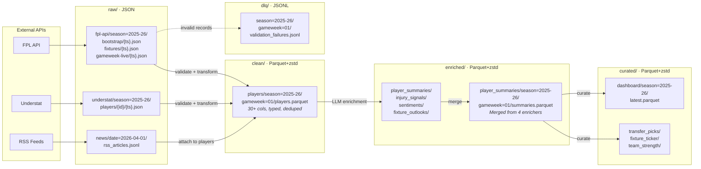

# Data Lake Layer Design

Single S3 bucket (`fpl-data-lake-dev`) with four processing layers and a dead-letter queue. Each layer represents a data quality stage with clear contracts on format, schema, and retention.

For full rationale, see [ADR-0002: S3 Data Lake Design](../adr/0002-s3-data-lake-design.md).

## Layer Flow



## Layer Contracts

| Layer | Format | Partitioning | Retention | Purpose |
|-------|--------|-------------|-----------|---------|
| `raw/` | JSON | `season=` / `date=` | 90 days | Preserve API responses exactly as received |
| `clean/` | Parquet (zstd) | `season=` / `gameweek=` | Indefinite | Validated, typed, deduplicated — predictable LLM inputs |
| `enriched/` | Parquet (zstd) | `season=` / `gameweek=` | Indefinite | LLM-augmented data, expensive to regenerate |
| `curated/` | Parquet (zstd) | `season=` | Indefinite | Dashboard-ready aggregations and derived metrics |
| `dlq/` | JSONL | `season=` / `gameweek=` | 30 days | Failed validation records for investigation |

## Partitioning

All layers use Hive-style partition keys, enabling:

- **Query pruning** — Athena, DuckDB, and pandas can skip irrelevant partitions
- **Idempotency** — check if output exists at a prefix before processing; skip if present
- **Lifecycle rules** — S3 lifecycle scoped by prefix (raw/ → Infrequent Access at 30d, expires at 90d)

```
s3://fpl-data-lake-dev/
  raw/fpl-api/season=2025-26/bootstrap/20260401T080000Z.json
  clean/players/season=2025-26/gameweek=01/players.parquet
  enriched/player_summaries/season=2025-26/gameweek=01/summaries.parquet
  curated/dashboard/season=2025-26/latest.parquet
  dlq/season=2025-26/gameweek=01/validation_failures.jsonl
```

## Why Four Layers

Each layer exists because removing it would create a concrete problem:

| Without this layer... | What breaks |
|-----------------------|------------|
| **raw/** | Can't reprocess without re-fetching APIs (rate-limited, may change) |
| **clean/** | LLM enrichment receives unvalidated, untyped data — unpredictable outputs |
| **enriched/** | Dashboard must re-run expensive LLM calls to get summaries |
| **curated/** | Every consumer repeats the same joins and aggregations |

## Idempotency Pattern

Each pipeline step checks whether its output already exists before processing:

```python
if not force and self._output_exists(prefix):
    return CollectionResponse(status="success", records_collected=0, output_path=prefix)
```

This works because each step writes a **single file per invocation**. S3 `PutObject` is atomic — the file either fully exists or doesn't. No partial write scenario is possible with single-file outputs.

The `force=True` parameter overrides the check for backfills and manual reprocessing.
