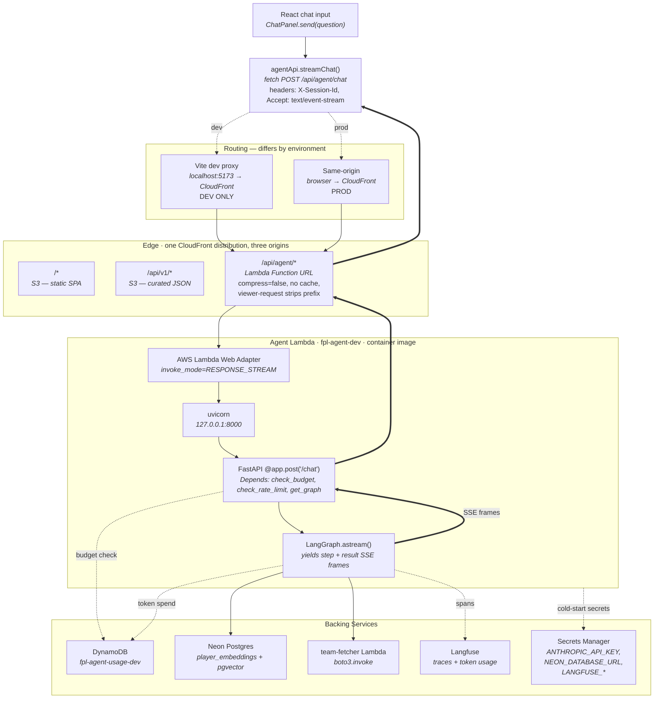

# Frontend ↔ Backend Wiring

How a chat message travels from the user's browser to the Scout Report agent and back — the edge, transport, and auth glue between the React dashboard and the FastAPI-on-Lambda backend.

This doc is specifically about the *wire* between surfaces. For the agent's graph internals (nodes, tools, reflection loop) see [agent-architecture.md](agent-architecture.md). For the *why* behind the transport choices see [ADR-0007](../adr/0007-static-dashboard-architecture.md) (single-CloudFront front door) and [ADR-0010](../adr/0010-agent-http-transport-lambda-function-url.md) (Function URL over API Gateway).

## Request Lifecycle



The double-line return path is the SSE stream: the same HTTP response that started at the browser carries `step` and `result` frames back through every layer without buffering.

For the full annotated diagram see [frontend-backend-wiring.drawio](frontend-backend-wiring.drawio).

## Frontend Stack

| Concern | Choice | Location |
|---------|--------|----------|
| Framework | React 19 + TypeScript | [web/dashboard/](../../web/dashboard/) |
| Bundler / dev server | Vite | [web/dashboard/vite.config.ts](../../web/dashboard/vite.config.ts) |
| Routing | react-router | [web/dashboard/src/App.tsx](../../web/dashboard/src/App.tsx) |
| Styling | Tailwind v4 | — |
| API client | hand-rolled `fetch` wrapper | [web/dashboard/src/lib/agentApi.ts](../../web/dashboard/src/lib/agentApi.ts) |
| State | `useReducer` + discriminated-union actions | [web/dashboard/src/pages/chat/chatReducer.ts](../../web/dashboard/src/pages/chat/chatReducer.ts) |
| Hosting | S3 static bucket behind CloudFront | [infrastructure/modules/web-hosting/](../../infrastructure/modules/web-hosting/) |

No backend-for-frontend, no SSR, no edge functions other than the CloudFront Function that rewrites the agent path. `npm run build` emits a static `dist/` and that is the entire deployment artefact.

## Dev vs Prod URL Resolution

The frontend never hardcodes the agent's domain. `agentApi.ts` uses a *relative* path:

```ts
const AGENT_BASE = "/api/agent";
await fetch(`${AGENT_BASE}/chat`, { ... });
```

Resolution depends on where the page was loaded from:

| Environment | Browser origin | Relative URL becomes | How it reaches Lambda |
|-------------|----------------|----------------------|------------------------|
| Production | `https://<cloudfront>.cloudfront.net` | `https://<cloudfront>.cloudfront.net/api/agent/chat` | CloudFront routes `/api/agent/*` to the Function URL origin |
| Local dev | `http://localhost:5173` | `http://localhost:5173/api/agent/chat` | Vite dev proxy forwards to `VITE_AGENT_PROXY_TARGET` (CloudFront) |

The dev proxy is configured in [vite.config.ts](../../web/dashboard/vite.config.ts) and only activates when `VITE_AGENT_PROXY_TARGET` is set (see [.env.example](../../web/dashboard/.env.example)). Developer-specific — the variable lives in `.env.development.local` which is gitignored.

**Why this matters:** the same bundle is environment-agnostic. `npm run build` takes no config, prod deploys don't need per-env JS, and the dev CORS story is a single middleware entry because the browser sees a same-origin request in both modes.

## CloudFront as the Path Router

One distribution, three origins. See [infrastructure/modules/web-hosting/main.tf](../../infrastructure/modules/web-hosting/main.tf).

| Path pattern | Origin | Cache | Purpose |
|--------------|--------|-------|---------|
| `/api/agent/*` | Lambda Function URL | Disabled | Dynamic agent endpoint, streaming |
| `/api/v1/*` | S3 data lake `/public/` | 24h | Pre-rendered JSON for the dashboard |
| `/*` (default) | S3 SPA bucket | Long TTL, invalidated on deploy | React static assets |

The agent behaviour has three non-obvious settings:

- **`compress = false`** — gzip requires knowing content-length upfront, which means buffering. Enabling it would silently defeat SSE. Confirmed failure mode: browser sees one large payload arrive after the full run finishes.
- **`cache_policy = CachingDisabled`** + **`origin_request_policy = AllViewerExceptHostHeader`** — no caching (POST bodies + per-user responses), but all viewer headers forward so `X-Session-Id` and `Content-Type` reach the Lambda.
- **Viewer-request CloudFront Function** strips the `/api/agent` prefix before the request hits the Function URL. FastAPI routes are mounted at `/chat`, `/team`, `/budget` — the app has no knowledge of the CloudFront path prefix.

```js
// infrastructure/modules/web-hosting/main.tf — CloudFront Function
function handler(event) {
  var request = event.request;
  request.uri = request.uri.replace(/^\/api\/agent/, '');
  if (request.uri === '') request.uri = '/';
  return request;
}
```

## Lambda Function URL + LWA

ADR-0010 covers the rationale for Function URL over API Gateway. The pieces in play:

| Piece | Configuration | Source |
|-------|---------------|--------|
| `aws_lambda_function_url` | `invoke_mode = "RESPONSE_STREAM"`, `authorization_type = "AWS_IAM"` — rejects any unsigned request | [agent.tf](../../infrastructure/environments/dev/agent.tf) |
| `aws_lambda_permission` | `principal = "cloudfront.amazonaws.com"`, scoped by `aws:SourceArn` to our distribution | [agent.tf](../../infrastructure/environments/dev/agent.tf) |
| CloudFront Lambda OAC | `origin_access_control_origin_type = "lambda"`, `signing_behavior = "always"` — CloudFront signs every origin request with SigV4 | [modules/web-hosting/main.tf](../../infrastructure/modules/web-hosting/main.tf) |
| AWS Lambda Web Adapter | Pinned sidecar image `public.ecr.aws/awsguru/aws-lambda-adapter:0.9.0`, env `AWS_LWA_INVOKE_MODE=response_stream` | [services/agent/Dockerfile](../../services/agent/Dockerfile) |
| uvicorn | Runs `fpl_agent.api:app` on `127.0.0.1:8000`; LWA translates RESPONSE_STREAM events ↔ local HTTP | Dockerfile CMD |

> **The two-gate model:** Function URLs AND together the URL's `authorization_type` (signature check) and the function's resource policy (allowed principals). `AWS_IAM` + a CloudFront-scoped resource policy means the only signed, permitted caller is this distribution. `curl` against the Function URL's `*.lambda-url.eu-west-2.on.aws` host returns 403. This is the hardened state after #123 — an earlier revision used `authorization_type = "NONE"` + `principal = "*"`, which worked but left the Function URL directly addressable on the public internet and bypassable around any future edge controls.

## FastAPI Request Handling

The entry point for every chat is [services/agent/src/fpl_agent/api.py](../../services/agent/src/fpl_agent/api.py).

```python
@app.post("/chat")
@observe(name="agent_chat_request")
async def chat_stream(
    req: ChatRequest,
    budget: BudgetTracker = Depends(check_budget),      # DynamoDB GetItem
    _rl: None = Depends(check_rate_limit),              # in-memory limiter
    graph: Any = Depends(get_graph),                    # compiled LangGraph
    x_session_id: str | None = Header(default=None, alias="X-Session-Id"),
) -> EventSourceResponse:
    ...
```

The dependency chain is the request-admission policy. In order:

1. **`check_budget`** — reads the current month row from `fpl-agent-usage-dev`, raises HTTP 429 if the monthly cap is exceeded.
2. **`check_rate_limit`** — per-session sliding window (5/min, 20/hour). Keyed on `X-Session-Id`, falls back to client IP.
3. **`get_graph`** — returns the compiled LangGraph from the lifespan-initialised resources.

Expensive things (Neon pool, `AsyncAnthropic` client, Langfuse init, compiled graph) happen once in the `lifespan` context and are reused across warm invocations. Cold start cost: ~3–5s; warm invocation overhead: negligible.

## SSE Over POST — the non-standard bit

The browser's built-in `EventSource` only supports GET and only sends cookies. The agent takes a JSON body (`ChatRequest` with question + optional squad), so `EventSource` is out.

[streamChat](../../web/dashboard/src/lib/agentApi.ts) in `agentApi.ts` hand-parses the SSE framing over a standard `fetch` response:

```ts
export async function* streamChat(req: ChatRequest, signal?: AbortSignal) {
  const res = await fetch(`${AGENT_BASE}/chat`, {
    method: "POST",
    headers: { ...authHeaders(), Accept: "text/event-stream" },
    body: JSON.stringify(req),
    signal,
  });
  // ...
  yield* parseSseStream(res.body);  // reads ReadableStream, splits on "\n\n"
}
```

On the server, `sse-starlette.EventSourceResponse` wraps an async generator that yields dicts. Each yield becomes one `event: <name>\ndata: <json>\n\n` frame:

```python
async def event_generator():
    async for update in graph.astream(initial_state(...), stream_mode="updates"):
        for node_name, partial in update.items():
            yield _sse("step", {"node": node_name})
    yield _sse("result", _agent_response(final_state).model_dump(mode="json"))

return EventSourceResponse(event_generator())
```

Every layer between FastAPI and the browser must preserve the stream:

- LWA with `RESPONSE_STREAM` mode — translates chunked writes to Lambda streaming events.
- Lambda Function URL with `invoke_mode = "RESPONSE_STREAM"` — forwards chunks immediately, no body accumulation.
- CloudFront with `compress = false` — no response buffering for gzip.

Break any one and the chat degrades to a slow blocking request that eventually dumps its whole payload.

## Auth & Session Identity

There is no login. The agent endpoint is public; protection is layered elsewhere:

| Layer | Mechanism | File |
|-------|-----------|------|
| Identity | `X-Session-Id` UUID, `localStorage["fpl.sessionId"]` | [web/dashboard/src/lib/sessionId.ts](../../web/dashboard/src/lib/sessionId.ts) |
| Rate limiting | In-memory sliding window keyed on session ID | [services/agent/src/fpl_agent/middleware/rate_limit.py](../../services/agent/src/fpl_agent/middleware/rate_limit.py) |
| Cost cap | DynamoDB monthly budget, returns 429 | [services/agent/src/fpl_agent/middleware/budget.py](../../services/agent/src/fpl_agent/middleware/budget.py) |
| Concurrency | Lambda `reserved_concurrent_executions = 10` | [infrastructure/environments/dev/lambda.tf](../../infrastructure/environments/dev/lambda.tf) |
| CORS | FastAPI `CORSMiddleware` — localhost + `AGENT_CORS_EXTRA_ORIGINS` env var | [services/agent/src/fpl_agent/api.py](../../services/agent/src/fpl_agent/api.py) |

Session ID has a second job: it's the trace grouping key in Langfuse. All messages from one browser tab appear as a single session timeline, which makes "why did the agent say X" debugging a one-click filter.

Secrets live in Secrets Manager and are fetched at cold-start by the lifespan handler. No keys in container env vars, no keys in Terraform state. See [security-architecture.md](security-architecture.md) for the threat model and upgrade triggers.

## Deployment

Two independent GitHub Actions pipelines, path-filtered on `web/**` and `services/agent/**`. See [.github/workflows/deploy.yml](../../.github/workflows/deploy.yml).

### Frontend

```
npm ci  →  npm run build  →  aws s3 sync dist/ s3://fpl-dashboard-dev
        →  aws cloudfront create-invalidation --paths "/*"
```

The invalidation is non-optional — CloudFront edge caches serve stale JS for hours otherwise.

### Agent

```
docker build (services/agent/Dockerfile)  →  docker push ECR (:sha and :latest)
                                          →  aws lambda update-function-code --image-uri <sha>
```

Lambda picks up the new image on the next cold start. Warm invocations finish on the old version; there's no draining step.

### Infra

`terraform apply` in [infrastructure/environments/dev/](../../infrastructure/environments/dev/) when `infrastructure/**` changes. Creates/updates the Function URL, CloudFront distribution, DynamoDB table, IAM, and secrets.

## Non-Obvious Bits

Small list of gotchas worth keeping in mind when touching this path:

- **The Lambda has no idea CloudFront exists at the app layer.** FastAPI sees `POST /chat` with no prefix, regardless of whether the request came through CloudFront. But you can no longer `curl` the Function URL directly as a debug escape hatch — since #123 the URL requires a CloudFront-scoped SigV4 signature and returns 403 for any other caller. For ad-hoc testing, either go through CloudFront (`curl https://<cloudfront>/api/agent/health`) or invoke the Lambda directly via `aws lambda invoke` using the dev role.
- **TypeScript types in [types.ts](../../web/dashboard/src/lib/types.ts) are hand-mirrored from the backend's Pydantic models.** No codegen. Change `ScoutReport` in `fpl_agent/models/responses.py` without updating the TS and the chat card silently renders stale fields.
- **The agent Lambda invokes the team-fetcher Lambda synchronously.** `GET /team` is one HTTP round-trip from the dashboard's perspective, but the agent container makes a boto3 call internally. The scoped IAM grant is in [agent.tf](../../infrastructure/environments/dev/agent.tf).
- **CORS only matters in dev.** Prod is same-origin via CloudFront. The middleware is permissive because localhost:5173 needs it.
- **Session ID is browser-persistent.** localStorage survives tab close and page reload. Different browser / profile / incognito = different session.

## Related Components

- [ADR-0007](../adr/0007-static-dashboard-architecture.md) — single CloudFront, S3 SPA, JSON data layer.
- [ADR-0009](../adr/0009-scout-report-agent-architecture.md) — agent framing, cost controls.
- [ADR-0010](../adr/0010-agent-http-transport-lambda-function-url.md) — Function URL over API Gateway, SSE requirements.
- [agent-architecture.md](agent-architecture.md) — graph internals, nodes, tools, observability.
- [security-architecture.md](security-architecture.md) — threat model, layered defences, hardening triggers.

## Related Files

**Frontend:**
- `web/dashboard/src/lib/agentApi.ts` — `streamChat`, `chatSync`, `fetchTeam`
- `web/dashboard/src/lib/sessionId.ts` — UUID persistence
- `web/dashboard/src/lib/types.ts` — Pydantic ↔ TS mirror
- `web/dashboard/src/pages/chat/ChatPanel.tsx` — chat UI + SSE consumer
- `web/dashboard/src/pages/chat/chatReducer.ts` — message state machine
- `web/dashboard/src/components/AskScoutDrawer.tsx` — floating drawer host
- `web/dashboard/vite.config.ts` — dev proxy

**Backend:**
- `services/agent/src/fpl_agent/api.py` — FastAPI app, routes, lifespan, CORS
- `services/agent/src/fpl_agent/middleware/budget.py` — DynamoDB budget tracker
- `services/agent/src/fpl_agent/middleware/rate_limit.py` — in-memory limiter
- `services/agent/Dockerfile` — LWA sidecar + uvicorn

**Infra:**
- `infrastructure/environments/dev/agent.tf` — Function URL + permissions + DynamoDB + IAM
- `infrastructure/environments/dev/web.tf` — CloudFront instantiation
- `infrastructure/modules/web-hosting/main.tf` — distribution, origins, behaviours, CloudFront Function
- `.github/workflows/deploy.yml` — FE + agent + infra pipelines
