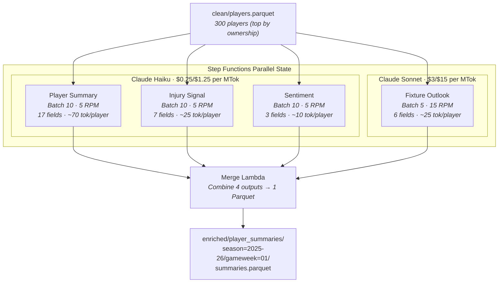
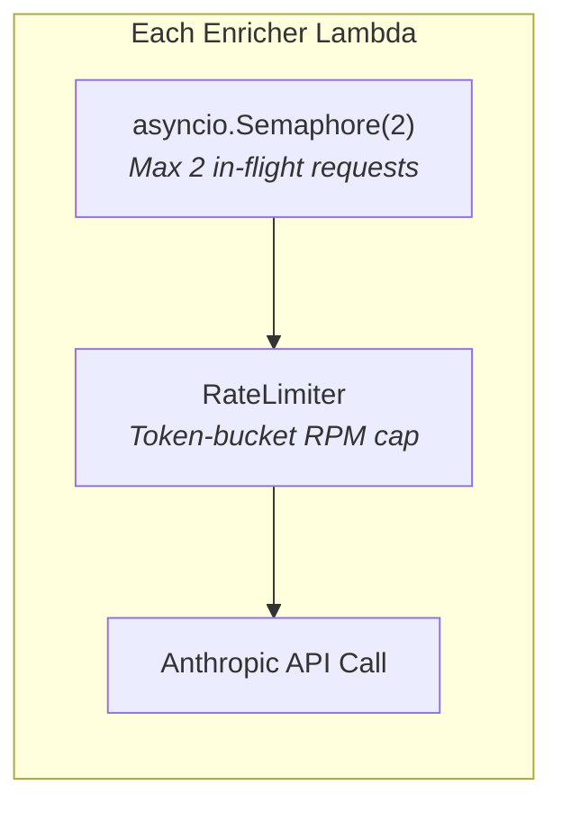
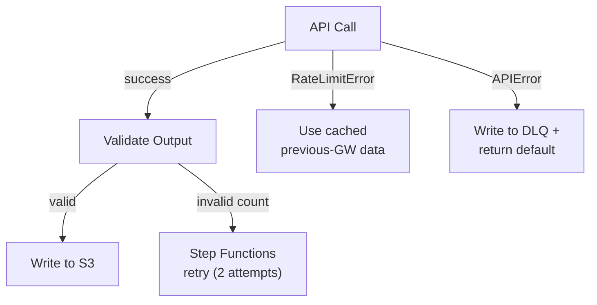

# LLM Enrichment Flow

The enrichment stage runs four independent LLM enrichers in parallel, each as a separate Lambda with its own timeout, rate limits, and failure isolation. A merge Lambda combines the outputs into a single Parquet file.

For cost analysis see [ADR-0004](../adr/0004-llm-cost-optimisation.md). For the parallelisation decision see [ADR-0006](../adr/0006-parallel-pipeline-design.md). For prompt versioning and observability see [ADR-0005](../adr/0005-prompt-versioning-and-llm-observability.md).

## Enrichment Pipeline



## Model Selection

Not all enrichment tasks need the same model. Classification tasks (summarise, detect, score) work well with Haiku. Reasoning tasks (analyse fixture sequences, project form trends) need Sonnet.

| Enricher | Task Type | Model | Why |
|----------|-----------|-------|-----|
| Player Summary | Classification | Haiku | Summarise stats into structured output — no complex reasoning |
| Injury Signal | Detection | Haiku | Flag injury risk from news + status fields |
| Sentiment | Scoring | Haiku | Score media sentiment — pattern matching, not reasoning |
| Fixture Outlook | Reasoning | Sonnet | Analyse 5-game sequences, team form interactions, schedule difficulty |

Testing showed Haiku produced generic fixture analysis ("moderate difficulty") while Sonnet provided actionable recommendations referencing specific fixtures. For the other three tasks, Haiku and Sonnet outputs were indistinguishable.

## Rate Limiting

Dual-mechanism rate control prevents API 429 errors:



| Mechanism | Purpose | Configuration |
|-----------|---------|---------------|
| `asyncio.Semaphore(2)` | Cap concurrent connections | Prevents connection pool 429s |
| `RateLimiter(rpm)` | Cap request rate | Token-bucket, enforces min interval between calls |

**RPM allocation across Lambdas:**

```
Haiku model limit: 50 RPM / 10K output TPM
├── PlayerSummary:  5 RPM
├── InjurySignal:   5 RPM
└── Sentiment:      5 RPM
    Total:         15 RPM (30% of limit)

Sonnet model limit: separate
└── FixtureOutlook: 15 RPM
```

Conservative allocation leaves headroom for retries and burst.

## Input Filtering

Each enricher declares `RELEVANT_FIELDS` — only those fields are sent to the LLM. A player record has 35+ fields (~185 tokens); most enrichers need 3-17.

```python
class SentimentEnricher(FPLEnricher):
    RELEVANT_FIELDS = ["web_name", "team", "news_articles"]  # 3 fields, not 35+
```

| Enricher | Fields Sent | Tokens/Player | vs Full Record |
|----------|------------|---------------|----------------|
| Sentiment | 3 | ~10 + articles | -95% |
| Injury Signal | 7 | ~25 + articles | -86% |
| Fixture Outlook | 6 | ~25 + fixtures | -86% |
| Player Summary | 17 | ~70 | -62% |

## Cost Breakdown

Per gameweek (300 players):

| Enricher | API Calls | Est. Cost | % of Total |
|----------|-----------|-----------|------------|
| Player Summary (Haiku) | 30 | ~$0.02 | 3% |
| Injury Signal (Haiku) | 30 | ~$0.01 | 1% |
| Sentiment (Haiku) | 30 | ~$0.01 | 1% |
| Fixture Outlook (Sonnet) | 60 | ~$0.68 | 94% |
| **Total** | **150** | **~$0.72** | |

**Season cost (38 gameweeks): ~$27**

Fixture Outlook dominates because Sonnet is 12x more expensive per input token and 12x per output token. This is acceptable — it's the only enricher where the quality difference justifies the cost.

## Failure Handling



- **RateLimitError** — graceful degradation, uses cached data from previous gameweek
- **APIError** — record goes to DLQ, player gets default/empty enrichment
- **Lambda timeout** — Step Functions catches and can retry independently per enricher
- **One enricher failing doesn't affect the other three** — isolated Lambda execution

## Observability

Every LLM call is traced via Langfuse `@observe` decorators:

- **Per call:** enricher name, batch size, prompt version, token counts, latency, model
- **Per gameweek:** session ID (`2025-26-gw01`), total cost, success/failure counts
- **Quality scores:** output count validation (did the LLM return N items for N inputs?)

Prompt version metadata enables A/B comparison when rolling out new prompt versions. Cost attribution per enricher is automatic — immediately visible that Fixture Outlook is 94% of spend.
