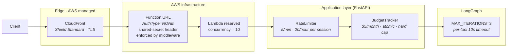

# Security Architecture

This document describes the security posture of the FPL platform — what we defend against, how, and what we have deliberately deferred. The agent chat endpoint is the only publicly-reachable attack surface; everything else is Lambda-to-Lambda or scheduled pipeline work inside the account.

Scope is explicitly portfolio/demo. Design choices favour "enough defence-in-depth to survive a curious interviewer hammering the endpoint" and an explicit upgrade path to production-grade controls. The posture is documented, not absolute.

## Threat model

| Threat | Likelihood | Impact | Owner |
|---|---|---|---|
| Cost runaway via the agent endpoint (accidental or malicious) | High (public demo) | £££ on the Anthropic bill | **Primary concern** |
| DDoS / L3-L4 volumetric flood | Low | Service unavailable | AWS Shield Standard |
| L7 flood targeting `/chat` to exhaust budget | Medium | Burn through the month's LLM cap | Layered defence below |
| Credential exfiltration from the repo or CI | Low | Full AWS account compromise | Secrets hygiene |
| Data poisoning in the enrichment pipeline | Low | Incorrect outputs, not a security breach | Out of scope |
| Insecure direct object reference (IDOR) | N/A | No multi-tenant data | Out of scope |

**The primary risk is cost runaway.** The endpoint is intentionally public (no auth, no API key) because the value proposition is a frictionless demo. Everything else is secondary.

## Defence in depth — agent chat endpoint

Layered from edge to application. Each layer catches a different class of abuse.

### 1. AWS Shield Standard — L3/L4 volumetric
Automatic and free whenever traffic flows through CloudFront. Covers SYN floods, reflection attacks, and other network-layer volumetric attacks at AWS edge capacity. No configuration needed.

### 2. CloudFront — TLS, geo, cache
- HTTPS-only (redirect-to-https on the `/api/agent/*` behaviour).
- CachingDisabled for agent paths — responses are dynamic SSE streams; caching would break streaming anyway.
- Geo restrictions currently off; available as a one-line distribution setting if abuse patterns warrant.

### 3. Lambda Function URL — transport
`AuthType = NONE`, `principal = "*"` on the resource policy (both `lambda:InvokeFunctionUrl` AND `lambda:InvokeFunction`, per AWS's Oct-2025 Function URL rule). CloudFront is the enforced entry point via a **shared-secret header** rather than AWS_IAM + OAC — see "Why not OAC" below.

**How the gate works.** Terraform generates a 48-char random password at apply time, stores it in Secrets Manager (`/fpl-platform/${env}/cloudfront-agent-secret`), and uses it as both:
- A CloudFront `origin_custom_header` value on the `/api/agent/*` behaviour — CloudFront injects `X-CloudFront-Secret: <value>` on every origin request.
- The secret value the Lambda fetches at cold-start into `$CLOUDFRONT_SHARED_SECRET`. [`cloudfront_secret.py`](../../services/agent/src/fpl_agent/middleware/cloudfront_secret.py) middleware compares incoming headers with `hmac.compare_digest` and returns 401 on mismatch.

Net effect: the Function URL's `*.lambda-url.eu-west-2.on.aws` host is not usefully reachable. A direct `curl` returns 401; a request signed by any other AWS account returns 401; only requests carrying the secret header succeed, and only CloudFront carries it. The only practical path to the agent is through this distribution.

This closes the edge-bypass class of attack: any future WAF rule, rate-based policy, geo-block, or edge logging added to the CloudFront `/api/agent/*` behaviour cannot be sidestepped by hitting the Function URL directly. `/health` is exempt from the middleware so Lambda Web Adapter's in-container readiness probe can run before CloudFront is in scope.

**Why not OAC.** OAC with `origin_type = "lambda"` signs origin requests with SigV4. For POST requests, SigV4 requires the *client* (browser, in our case) to compute `SHA256(body)` and pass it in the `x-amz-content-sha256` header — CloudFront OAC doesn't hash bodies itself. Browsers don't compute that hash, so every `POST /chat` would fail signature validation at the Function URL. We verified this in-incident: with OAC + AWS_IAM, Lambda metrics showed `Url4xxCount == UrlRequestCount` (100% rejection) despite correct IAM configuration. Documented at [AWS re:Post](https://repost.aws/questions/QUbHCI9AfyRdaUPCCo_3XKMQ). `GET /team` would have worked on OAC; POST wouldn't. Shared-secret works uniformly for both.

**Rotation.** `terraform taint random_password.cloudfront_agent_secret && terraform apply` regenerates the secret. CloudFront distribution update (~5 min propagation) and the Lambda cold-start race briefly — in-flight requests during the window may 401 until the next Lambda cold-start picks up the new value from Secrets Manager. Acceptable at dev scale; production would overlap old+new by keeping both valid for a grace window.

### 4. Lambda reserved concurrency — infrastructure backpressure
`reserved_concurrent_executions = 10` on the agent Lambda. When more than 10 requests are in-flight concurrently, Lambda itself returns 429 without invoking the function. This replaces API Gateway's endpoint throttling (removed per ADR-0010) with infrastructure-level enforcement.

Properties:
- **Cap blast radius.** A 100-rps flood gets 10 concurrent Lambdas; the other 90 rps hit 429 without cost.
- **Per-account isolation.** Reserving concurrency here also protects other Lambdas in the account from this one's traffic spikes.
- **Crude.** Treats legitimate and abusive traffic the same. For a demo with single-digit concurrent real users, acceptable.

### 5. Application `RateLimiter` — per-session fairness
In-memory sliding-window limiter inside FastAPI ([`services/agent/src/fpl_agent/middleware/rate_limit.py`](../../services/agent/src/fpl_agent/middleware/rate_limit.py)). 5 requests/minute and 20/hour, keyed by `X-Session-Id` header with client-IP fallback.

Known limitations documented in the code:
- Per-Lambda-container state, so the effective limit scales with warm-container count.
- Session ID is client-supplied and rotatable, so a determined attacker can bypass. The BudgetTracker is the hard backstop for this case.

### 6. `BudgetTracker` — financial hard cap
Atomic monthly cost counter in DynamoDB ([`services/agent/src/fpl_agent/middleware/budget.py`](../../services/agent/src/fpl_agent/middleware/budget.py)). Checked before every `/chat` request; increments atomically after. At $5/month, returns 429 and no further LLM calls are made. This is the cost runaway backstop — if every other layer fails, spend is still bounded.

See ADR-0009 for the decision to enforce via DynamoDB rather than Langfuse (request-path reliability + atomic increments).

### 7. `MAX_ITERATIONS=3` + per-tool timeout — per-request bound
Inside the graph: reflector cannot loop more than 3 times; each tool call has a 10-second timeout. Ensures a single request can't accidentally spin up unbounded work, even in the presence of a flawed planner output.

## Secrets management

- All runtime secrets live in AWS Secrets Manager under `/fpl-platform/{env}/*`: Anthropic API key, Langfuse public + secret keys, Neon database URL.
- Lambda IAM role grants `secretsmanager:GetSecretValue` scoped to the specific secret ARNs — no wildcards.
- Secrets are never logged. Langfuse traces include LLM inputs/outputs but not API keys.
- `.env` files are git-ignored; no credentials committed.
- Terraform state (`s3://fpl-dev-tf-state`) has versioning + encryption; access restricted to the CI role and the developer's AWS profile.

## IAM posture

- Per-Lambda execution roles with least-privilege: each Lambda's role grants only the actions on only the resources that Lambda touches (S3 prefix, Secrets Manager ARN, DynamoDB table).
- No `*` on Action or Resource except where unavoidable (CloudWatch Logs for all Lambdas).
- Shared `lambda-role` module applies consistent trust policy + basic execution + X-Ray write. Service-specific inline policies layer on top.

## What we deliberately don't do (yet)

Explicit non-goals for the current scope, with the trigger that would change the answer:

| Deferred | Trigger to add |
|---|---|
| **WAF with rate-based rule per IP** | Observed L7 abuse OR production traffic ≥ £5/month WAF cost threshold |
| **Request authentication (Cognito / API key)** | Product becomes multi-tenant OR needs user-specific state |
| **VPC-isolated Lambdas** | Compliance requirement OR Neon → private networking (currently Neon is accessed via public endpoint with TLS) |
| **AWS Shield Advanced** | Production SLA requirements; £££/month cost |
| **Per-IP rate limiting at the edge** | Session-ID rotation abuse observed |
| **Automated secret rotation** | Long-lived production deployment |

## Observability and incident response

- **CloudWatch Logs** on every Lambda (14-day retention in dev).
- **Langfuse traces** on every LLM call — enables post-hoc cost attribution and abuse pattern detection.
- **DynamoDB `exceeded_at`** timestamp stamped the first time the monthly budget is crossed — surfaces in the `BudgetTracker` for alerting later.
- **No paging / alerting** currently. A burned monthly budget is the only consequence of an incident; the `exceeded_at` field is the signal to investigate.

## References

- [ADR-0009: Scout Report Agent Architecture](../adr/0009-scout-report-agent-architecture.md) — cost controls and iteration caps
- [ADR-0010: Agent HTTP Transport](../adr/0010-agent-http-transport-lambda-function-url.md) — why reserved concurrency replaced API Gateway throttling
- [ADR-0005: Prompt Versioning and LLM Observability](../adr/0005-prompt-versioning-and-llm-observability.md) — Langfuse tracing posture
