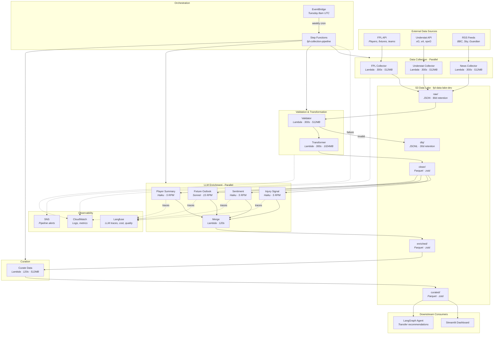

# System Architecture Overview

The FPL platform is a serverless data pipeline that collects Fantasy Premier League data, enriches it with LLM analysis, and serves dashboard-ready datasets. Everything runs on AWS, orchestrated by Step Functions, triggered weekly by EventBridge.

## Architecture Diagram

## Component Summary

| Layer | Components | Key Technology |
|-------|-----------|----------------|
| Orchestration | EventBridge, Step Functions | Weekly cron, parallel states, retry/catch |
| Collection | 3 Lambda collectors + gameweek resolver | httpx, feedparser, asyncio |
| Processing | Validator + Transformer | Great Expectations, PyArrow, pandas |
| Enrichment | 4 enricher Lambdas + merger | Anthropic SDK, asyncio.Semaphore, Langfuse |
| Curation | Curate Lambda (6 curators) | pandas, PyArrow |
| Storage | Single S3 bucket, 4 layers + DLQ | Hive partitioning, Parquet + zstd |
| Infrastructure | Terraform modules (Lambda, ECR, S3, Step Functions) | HCL, S3 backend |
| CI/CD | GitHub Actions (path-filtered) | dorny/paths-filter, ECR push |

## Key Design Decisions

- **Serverless-only** — no EC2, no ECS, no VPC. Lambda + Step Functions keeps costs near-zero when idle (pipeline runs once per week).
- **Single S3 bucket** with prefix-based layers rather than separate buckets per stage. See [ADR-0002](../adr/0002-s3-data-lake-design.md).
- **Container images** for all Lambdas (PyArrow + pandas exceed the 250MB zip limit). Multi-stage Dockerfiles, one ECR repo per service.
- **Direct Anthropic SDK** instead of LangChain — simpler dependency tree, full prompt control. See [ADR-0003](../adr/0003-direct-api-over-langchain.md).
- **Shared IAM role** across all Lambdas (acceptable at current scale; per-Lambda roles are the next step).
